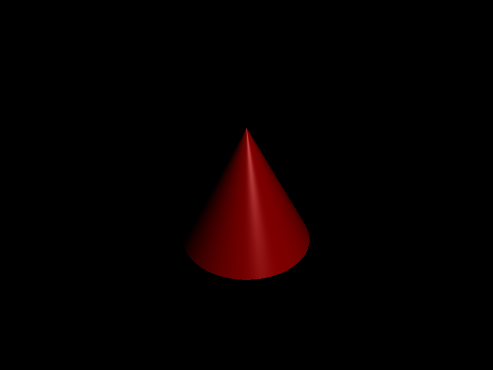
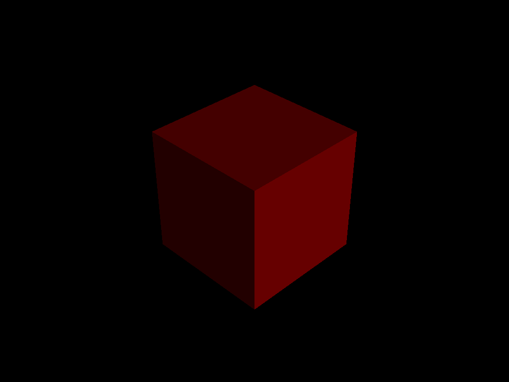

## Project 3: Intersect

Please fill this out for Intersect only. The project handout can be found [here](https://cs1230.graphics/projects/ray/1).

### Output Comparison
<!-- When you render the appropriate file, save the image to the `student_outputs/` folder, under the exact same name as the `json`, but with the `.png` extension. For example, to compare `unit_cone`, render `unit_cone.ini` and save it to `student_outputs/unit_cone.png`. -->
Run ray with the specified `.ini` file to compare your output (it should automatically save to the correct path).

> Note: once all images are filled in, the images will be the same size in the expected and student outputs.

| File/Method To Produce Output | Expected Output | Your Output |
| :---------------------------------------: | :--------------------------------------------------: | :-------------------------------------------------: |
| unit_cone.ini |   |  |
| unit_cone_cap.ini |  |  |
| unit_cube.ini |  |  |
| unit_cylinder.ini |  |  |
| unit_sphere.ini |  |  |
|  |  |  |  |
| parse_matrix.ini |  |  |
|  |  |  |  |
| ambient_total.ini |  |  |
| diffuse_total.ini |  |  |
| specular_total.ini |  |  |
| phong_total.ini |  |  |
|  |  |  |  |
| directional_light_1.ini |  |  |
| directional_light_2.ini |  |  |
|  |  |  |  |

### Design Choices

### Collaboration/References

### Known Bugs

### Extra Credit
